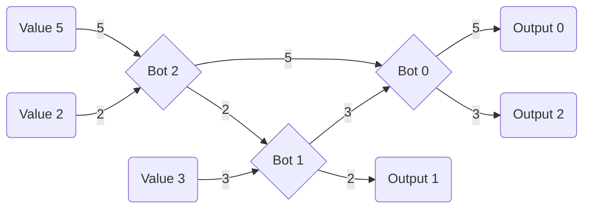

```mermaid
graph LR
    in5(Value 5) -- 5 --> bot2{Bot 2}
    in3(Value 3) -- 3 --> bot1{Bot 1}
    in2(Value 2) -- 2 --> bot2{Bot 2}
    bot2{Bot 2} -- 5 --> bot0{Bot 0}
    bot2{Bot 2} -- 2 --> bot1{Bot 1}
    bot1{Bot 1} -- 3 --> bot0{Bot 0}
    bot1{Bot 1} -- 2 --> output1(Output 1)
    bot0{Bot 0} -- 5 --> output0(Output 0)
    bot0{Bot 0} -- 3 --> output2(Output 2)
```